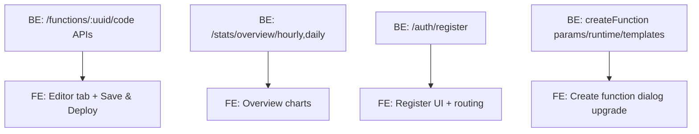

# Roadmap

**Last Updated**: 2025-12-21  
**Updated By**: Platform Engineering (Docs automation)  
**Time Basis**: 2-week sprints with ~20% buffer per milestone

## Immediate Next Steps (Priority: High)

### 1. Function Details Page (Status: Mostly Implemented)

- [x] **Overview Stats Cards** (Owner: FE)
  - Implemented in `lib/ui/widgets/overview_function_tab.dart`:
    - Total invocations, errors, error rate, average latency, last invocation
- [x] **Overview Call History Charts** (Owner: FE)
  - Hourly and daily charts implemented using `fl_chart`
  - Data sources:
    - `GET /api/functions/:uuid/stats/hourly?hours=24`
    - `GET /api/functions/:uuid/stats/daily?days=7`
- [x] **Deployment Management** (Owner: FE)
  - Implemented in `lib/ui/widgets/deployments_tab.dart`:
    - Active deployment section (based on `isLatest`)
    - Rollback flow with confirmation dialog
    - Sorting for previous deployments
- [x] **API Key Management** (Owner: FE)
  - Implemented in `lib/ui/widgets/api_keys_tab.dart`:
    - List keys, generate key (with secret display), revoke/delete/roll/enable (client support)
    - Optional local secure storage using `ApiKeyStorage`
- [x] **Invoke Tool (Basic)** (Owner: FE)
  - Implemented in `lib/ui/widgets/invoke_tab.dart`:
    - JSON request body input
    - Signed/unsigned toggle and secret key input
    - Response rendering and copy action

### 2. Editor Integration (Status: Planned)

- [ ] **Function Code Editor Tab** (Owner: FE, Depends on: BE API)
  - Integration points:
    - New tab in `lib/ui/pages/function_details_page.dart`
    - Provider(s) in `lib/providers/function_details_provider.dart`
    - API client methods in `packages/cloud_api_client/lib/src/cloud_api_client_base.dart`
  - Required APIs:
    - `GET /api/functions/:uuid/code` (returns code, runtime, entry point)
    - `PUT /api/functions/:uuid/code` (saves code and triggers deploy)
  - User workflow:
    - Open function → Code tab → load current code → edit → Save & Deploy → show deployment result and refresh deployments tab

### 3. Enhanced Statistics (Status: Partially Implemented)

- [x] **Per-Function Stats** (Owner: FE/BE)
  - Implemented metrics and charts are already in function details overview
- [ ] **Global Overview: More Stats & Visualizations** (Owner: FE, Depends on: BE API)
  - Add charts and richer cards to `lib/ui/views/overview_view.dart`
  - Data sources:
    - `GET /api/stats/overview?period=...`
    - Planned: `GET /api/stats/overview/hourly`, `GET /api/stats/overview/daily` (verify backend availability vs UI)
  - Refresh mechanisms:
    - Manual refresh button in dashboard header
    - Period selector (1h / 24h / 7d / 30d) with cached provider invalidation

### 4. Registration UI Improvements (Status: Missing)

- [ ] **Registration Page + Routing** (Owner: FE, Depends on: BE API)
  - Current state:
    - Backend client supports register via `POST /api/auth/register`
    - UI only has `LoginPage` and social buttons are no-op
  - UI elements to implement:
    - Email, password, confirm password
    - Validation (email format, password rules, match confirm password)
    - Clear error display and loading states
    - Link from Login → Register and Register → Login
  - Success metrics:
    - Registration completes and user can login immediately
    - Field validation blocks invalid submissions
    - Error states shown without breaking layout

### 5. “Create Empty” Function Enhancement (Status: Needs Upgrade)

- [ ] **Improve Create Function Dialog** (Owner: FE, Depends on: BE API)
  - Current limitation:
    - Only collects function name (`lib/ui/views/functions_view.dart`)
    - Uses `POST /api/functions/init` with `{ name }`
  - Upgrade requirements:
    - Runtime selection (Node/Python/Go/Dart) and template selection
    - Optional memory/timeout parameters
    - Clear empty-state explanation of what “empty” means in backend terms

## Medium Term (Priority: Medium)

### 1. Post-Implementation Planning (Maintenance & Monitoring)

- [ ] **Operational Readiness Checklist** (Owner: DevOps/BE)
  - Monitoring requirements:
    - Track API latency, error rates, auth refresh failures, deploy failures
  - Maintenance needs:
    - Dependency upgrades policy
    - Error reporting and observability integration plan

### 2. Authentication Enhancements

- [ ] **Social Login** (Owner: FE/BE)
  - Current state: Buttons exist in `lib/ui/pages/login_page.dart`, callbacks are empty
  - Target:
    - Implement OAuth flow end-to-end (backend + UI)

### 3. Functionality

- [ ] **Webhooks** (Owner: FE/BE)
- [ ] **Containers** (Owner: FE/BE)
- [ ] **Settings** (Owner: FE)

## Future Enhancements (Priority: Low)

### 1. UX/UI

- [ ] **Responsive Design** (Owner: FE)
- [ ] **Dark Mode** (Owner: FE)

### 2. DevOps

- [ ] **CI/CD** (Owner: DevOps)
- [ ] **Docker** (Owner: DevOps)

## Milestones, Dependencies, Timelines

**Milestone Targets (est.)**

- M1: Registration UI (Sprint 1–2, with buffer): 2026-01-19  
- M2: Create Function upgrade (Sprint 2–3, with buffer): 2026-02-02  
- M3: Editor integration (Sprint 3–5, with buffer): 2026-03-02  
- M4: Global overview stats enhancements (Sprint 4–5): 2026-03-02  

**Dependency Map**

