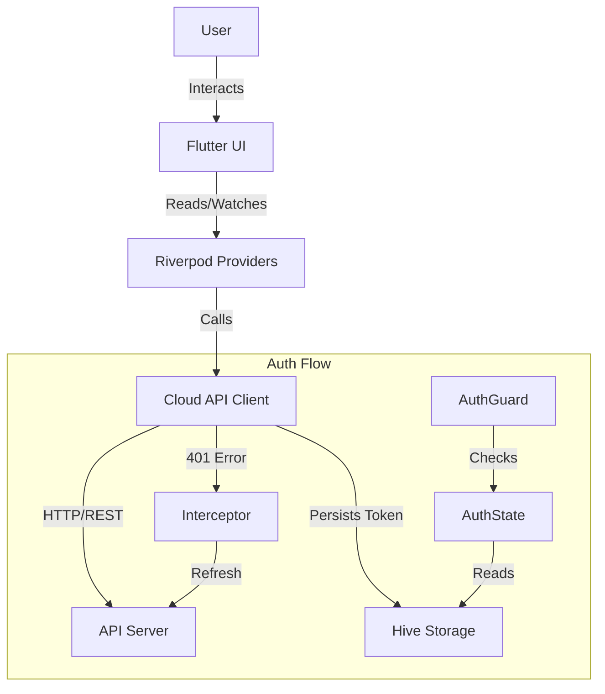
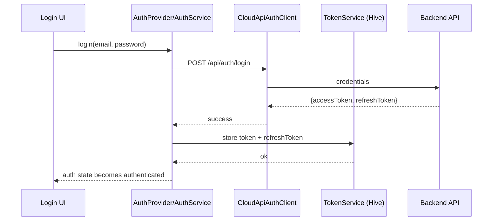
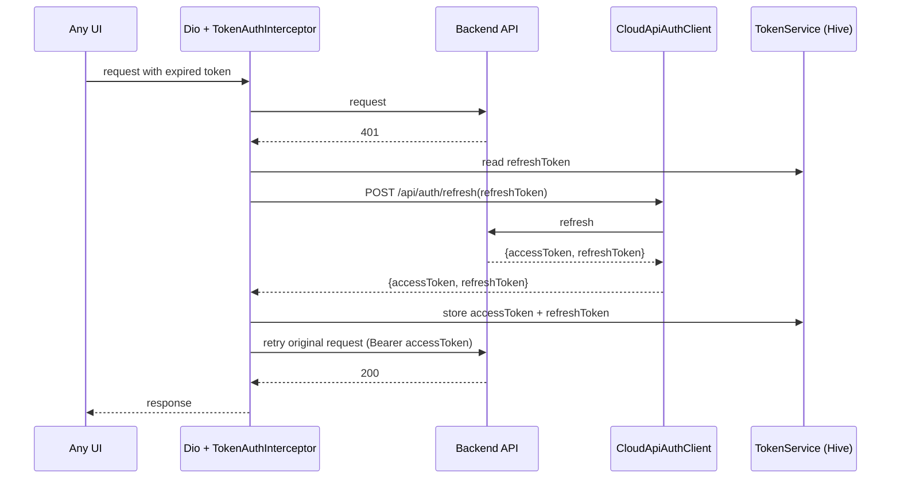
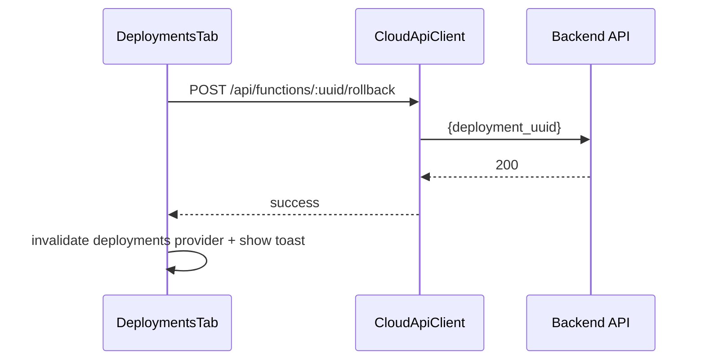

# Technical Specifications

**Last Updated**: 2025-12-21  
**Owner**: Platform Engineering

## Tech Stack

### Frontend
- **Language**: Dart 3.x
- **Framework**: Flutter 3.10+
- **Platform**: Web (Primary), MacOS (Supported)

### State Management & Architecture
- **Riverpod**: Used for dependency injection (DI) and state management.
  - `Provider`: For static dependencies (Dio, API Client).
  - `NotifierProvider`: For complex state (Auth, Forms).
  - `FutureProvider`: For async data fetching (Lists, Details).
- **Architecture**: Feature-first / Layered
  - `ui/`: Widgets and Pages.
  - `providers/`: State logic and ViewModels.
  - `packages/cloud_api_client`: Data layer (Repository pattern).

### Navigation
- **AutoRoute**:
  - `AppRouter`: Central routing configuration.
  - `AuthGuard`: Route protection middleware.
  - `AutoTabsRouter`: Nested navigation for the Dashboard.

### Networking
- **Dio**: HTTP Client.
- **Interceptors**:
  - `TokenAuthInterceptor`: Handles JWT injection and refresh flow.
  - Optional: `LogInterceptor` for debugging (not enabled by default).

### Storage
- **Hive**: NoSQL local storage.
  - Box `auth`: Stores `token` and `refreshToken`.

## Implemented Modules (Cross-Referenced)

### Cloud Panel UI

- `lib/ui/pages/login_page.dart`: Login form + social buttons (no-op callbacks)
- `lib/ui/pages/dashboard_page.dart`: App shell, navigation
- `lib/ui/views/overview_view.dart`: Global overview stats cards (period currently fixed)
- `lib/ui/views/functions_view.dart`: Functions list + create function dialog
- `lib/ui/pages/function_details_page.dart`: Function details tabs + refresh
  - `lib/ui/widgets/overview_function_tab.dart`: Per-function stats cards + charts
  - `lib/ui/widgets/deployments_tab.dart`: Deployment list + rollback dialog
  - `lib/ui/widgets/api_keys_tab.dart`: API key generation + listing + optional local storage
  - `lib/ui/widgets/invoke_tab.dart`: Invoke tool

### Cloud API Client (Data Layer)

- `packages/cloud_api_client/lib/src/cloud_api_client_base.dart`: Core API calls + shared error handling
- `packages/cloud_api_client/lib/src/interceptors/token_interceptor.dart`: Auth header + refresh orchestration
- `packages/cloud_api_client/lib/src/models/*`: Typed models for UI usage

## Deployment

### Prerequisites
- Flutter SDK
- Bun (for JS/Node dependencies if any)

### Build
To build the application for web:
```bash
flutter build web --release
```
The artifacts will be in `build/web`.

### Running Locally
```bash
flutter run -d chrome
```

## Architecture Diagram (Simplified)



## Component Interactions (Sequence Diagrams)

### Login + Automatic Refresh





### Rollback Deployment (Function Details → Deployments Tab)



## Key Implementation Patterns (Code Examples)

### Pattern: Provider-driven fetch + manual refresh

```dart
final functionStatsProvider = FutureProvider.family<FunctionStats, String>((
  ref,
  uuid,
) async {
  final client = ref.watch(apiClientProvider);
  return client.getStats(uuid);
});
```

Refresh mechanism example (see `lib/ui/pages/function_details_page.dart`):

```dart
ref.invalidate(functionStatsProvider(uuid));
```

### Pattern: Shared API error handling

```dart
Future<T> _handleRequest<T>(Future<Response> Function() request) async {
  try {
    final response = await request();
    return response.data;
  } on DioException catch (e) {
    final message = e.response?.data['error'] ?? e.message;
    final statusCode = e.response?.statusCode;
    if (statusCode == 401) throw AuthException(message.toString());
    if (statusCode == 404) throw NotFoundException(message.toString());
    throw CloudApiException(message.toString(), statusCode: statusCode, data: e.response?.data);
  }
}
```

## Versioning, Changelog, Branching (Process Requirements)

### Semantic Versioning

- `cloud_panel` (app): `MAJOR.MINOR.PATCH`
  - `MAJOR`: breaking UX flows or incompatible API contract changes
  - `MINOR`: additive features (new tabs, new pages, new providers)
  - `PATCH`: bug fixes, UI polish, localization fixes
- `cloud_api_client` (package): `MAJOR.MINOR.PATCH`
  - `MAJOR`: breaking API surface changes
  - `MINOR`: adding new endpoints/models (backwards compatible)
  - `PATCH`: bug fixes, parsing tweaks, better error mapping

### Changelog Entries

- Maintain an “Unreleased” section in `docs/STATUS.md` until a dedicated changelog file exists.
- Each entry includes:
  - Feature name
  - User impact
  - Key files changed (paths)

### Branch Management Protocol

- Branch name format: `feat/<area>-<short-desc>` or `fix/<area>-<short-desc>`
- Merge strategy: squash merge with conventional title
- Required checks before merge:
  - Unit tests passing
  - Widget tests passing (if UI changed)
  - Localization keys updated if user-facing strings changed

## Test Plan (Targets and Scenarios)

### Coverage Targets

- `cloud_api_client`: ≥80% unit coverage for models + API client methods
- `cloud_panel`: widget tests for critical flows (login, function list, details tabs)

### Integration Scenarios

- Login → token persisted → app restart restores session
- Token refresh on 401 retries request and recovers UI
- Function details:
  - Overview stats load + chart series empty state
  - Deployments rollback success path + failure path
  - API key generation shows secret once + save locally
  - Invoke signed vs unsigned requests

### User Acceptance Criteria (UAT)

- No blank states without actionable messaging
- All destructive actions require confirmation
- Loading states are visible and do not block navigation unexpectedly
- All user-visible strings are localized (no hard-coded English strings in widgets)
