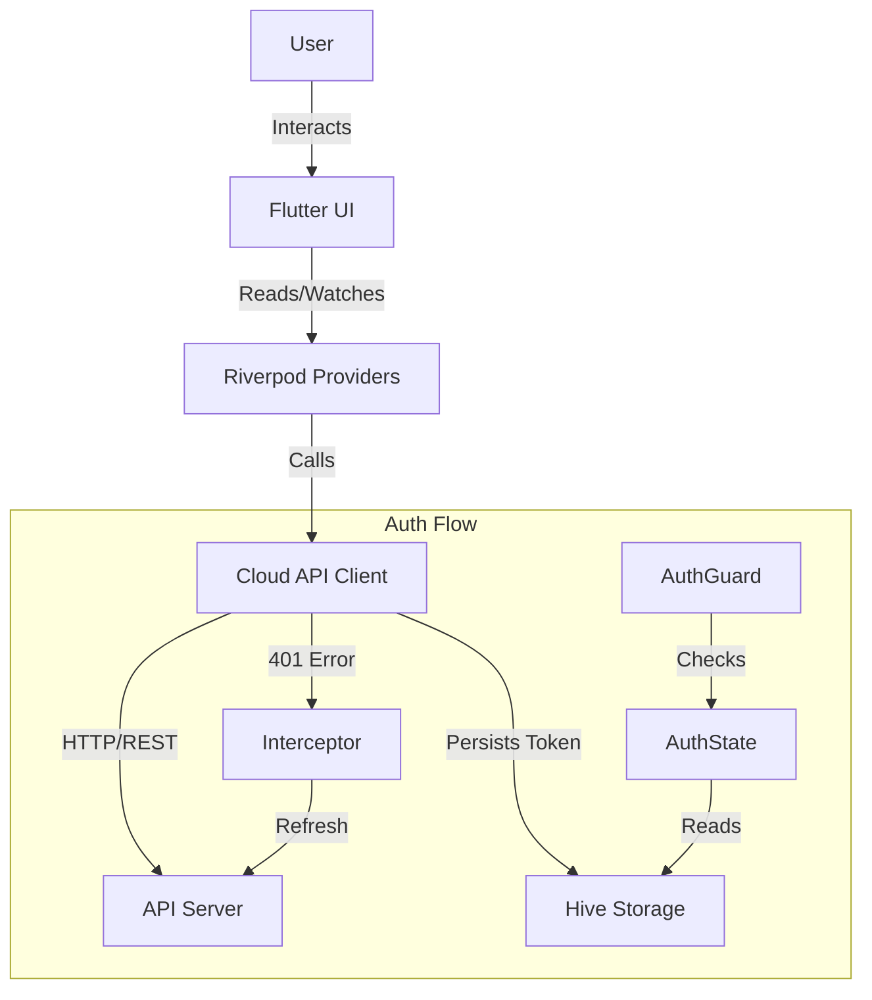

# Technical Specifications

## Tech Stack

### Frontend
- **Language**: Dart 3.x
- **Framework**: Flutter 3.10+
- **Platform**: Web (Primary), MacOS (Supported)

### State Management & Architecture
- **Riverpod**: Used for dependency injection (DI) and state management.
  - `Provider`: For static dependencies (Dio, API Client).
  - `NotifierProvider`: For complex state (Auth, Forms).
  - `FutureProvider`: For async data fetching (Lists, Details).
- **Architecture**: Feature-first / Layered
  - `ui/`: Widgets and Pages.
  - `providers/`: State logic and ViewModels.
  - `packages/cloud_api_client`: Data layer (Repository pattern).

### Navigation
- **AutoRoute**:
  - `AppRouter`: Central routing configuration.
  - `AuthGuard`: Route protection middleware.
  - `AutoTabsRouter`: Nested navigation for the Dashboard.

### Networking
- **Dio**: HTTP Client.
- **Interceptors**:
  - `TokenAuthInterceptor`: Handles JWT injection and refresh flow.
  - `LogInterceptor`: For debugging (dev mode).

### Storage
- **Hive**: NoSQL local storage.
  - Box `auth`: Stores `token` and `refreshToken`.

## Deployment

### Prerequisites
- Flutter SDK
- Bun (for JS/Node dependencies if any)

### Build
To build the application for web:
```bash
flutter build web --release
```
The artifacts will be in `build/web`.

### Running Locally
```bash
flutter run -d chrome
```

## Architecture Diagram (Simplified)


